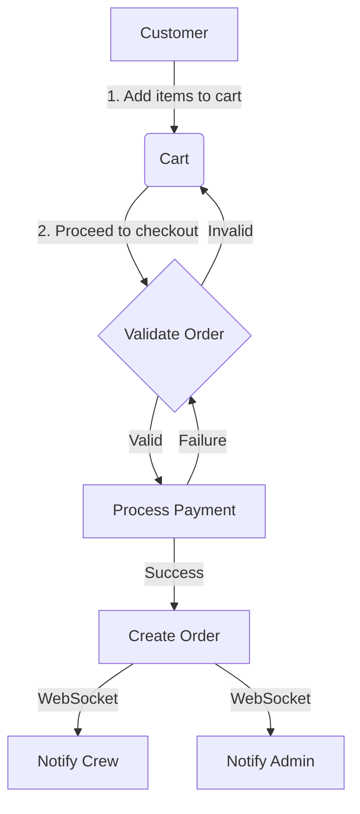
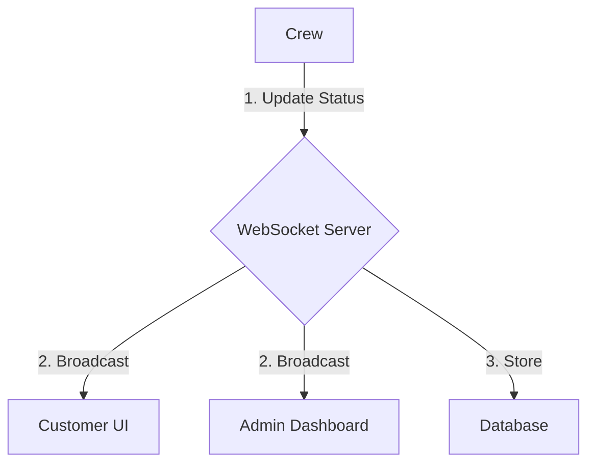
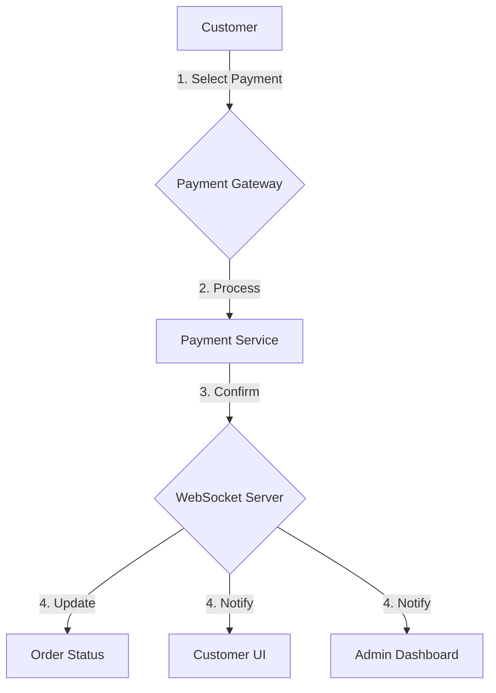
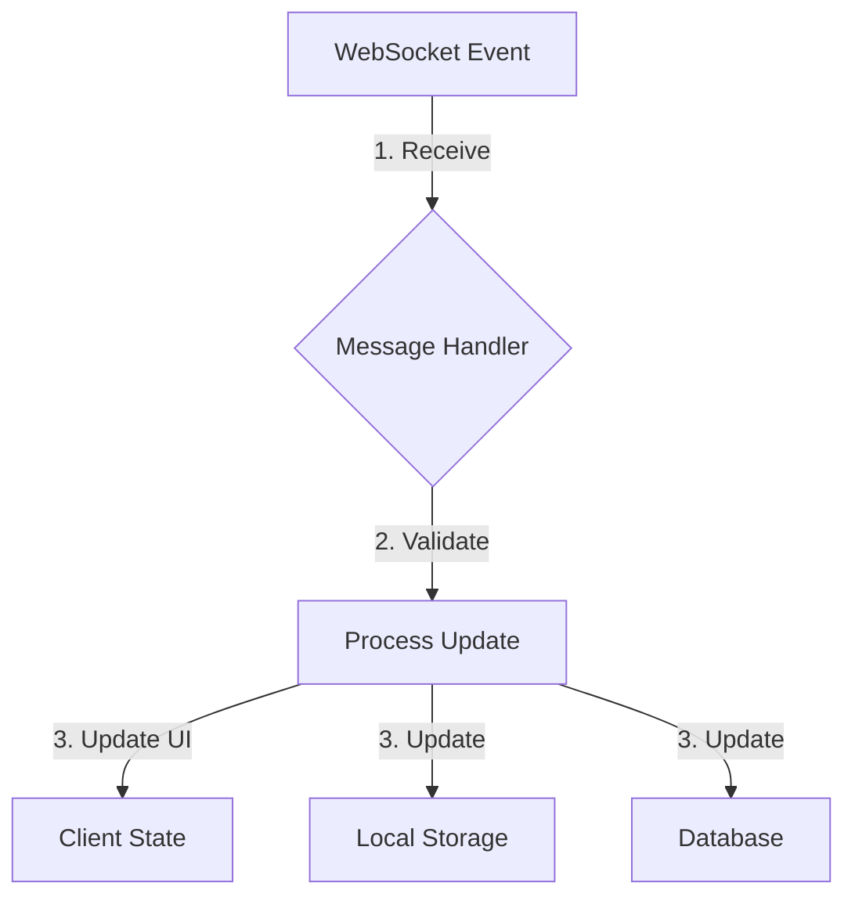

# KfoodDelights Data Flow Documentation

## Order Processing Flow

### 1. Customer Places Order



### 2. Order Status Updates



### 3. Payment Flow



## Real-time Data Propagation

### 1. WebSocket Message Flow

```javascript
// 1. Message Creation
const message = {
  type: "order_update",
  data: {
    orderId: 123,
    status: "preparing",
    timestamp: "2025-09-19T10:00:00Z",
  },
};

// 2. Server Processing
function processMessage(message) {
  validateMessage(message);
  routeMessage(message);
  broadcastUpdate(message);
  logActivity(message);
}

// 3. Client Reception
wsManager.on("order_update", (data) => {
  updateUI(data);
  notifyUser(data);
  updateLocalStorage(data);
});
```

### 2. Data Synchronization



## Module Data Exchange

### 1. Customer → Crew

- New order notifications
- Special instructions
- Customer details
- Order modifications

### 2. Crew → Customer

- Order status updates
- Preparation time updates
- Delivery estimates
- Special notifications

### 3. Admin ↔ All

- System announcements
- Maintenance notifications
- Menu updates
- Promotional messages

## Data Storage and Persistence

### 1. Local Storage

```javascript
// Client-side data caching
class LocalDataManager {
  storeOrderData(order) {
    localStorage.setItem(`order_${order.id}`, JSON.stringify(order));
  }

  getOrderData(orderId) {
    return JSON.parse(localStorage.getItem(`order_${orderId}`));
  }
}
```

### 2. Database Operations

```php
// Server-side data persistence
class OrderManager {
    public function updateOrderStatus($orderId, $status) {
        $query = "UPDATE orders SET status = ? WHERE id = ?";
        $stmt = $this->conn->prepare($query);
        $stmt->bind_param("si", $status, $orderId);

        if ($stmt->execute()) {
            $this->broadcastUpdate($orderId, $status);
            return true;
        }
        return false;
    }
}
```

## Error Handling and Recovery

### 1. Connection Issues

```javascript
class ConnectionManager {
  handleDisconnect() {
    this.attemptReconnect();
    this.enablePollingFallback();
    this.notifyUser();
  }

  attemptReconnect() {
    let attempts = 0;
    const maxAttempts = 5;

    const tryReconnect = () => {
      if (attempts >= maxAttempts) {
        this.enablePollingFallback();
        return;
      }

      this.connect().catch(() => {
        attempts++;
        setTimeout(tryReconnect, 3000 * attempts);
      });
    };

    tryReconnect();
  }
}
```

### 2. Data Consistency

```javascript
class DataConsistencyManager {
  validateOrderState(order) {
    const validStates = ["pending", "preparing", "ready", "delivered"];
    if (!validStates.includes(order.status)) {
      this.logError("Invalid order state");
      this.revertToLastValidState(order);
      return false;
    }
    return true;
  }
}
```

## Performance Optimization

### 1. Message Batching

```javascript
class MessageBatcher {
  constructor() {
    this.queue = [];
    this.batchSize = 10;
    this.batchInterval = 1000; // 1 second
  }

  addToQueue(message) {
    this.queue.push(message);
    if (this.queue.length >= this.batchSize) {
      this.processBatch();
    }
  }

  processBatch() {
    if (this.queue.length === 0) return;

    const batch = this.queue.splice(0, this.batchSize);
    this.sendBatch(batch);
  }
}
```

### 2. Caching Strategy

```javascript
class CacheManager {
  constructor() {
    this.cache = new Map();
    this.maxAge = 5 * 60 * 1000; // 5 minutes
  }

  setCacheItem(key, value) {
    this.cache.set(key, {
      value,
      timestamp: Date.now(),
    });
  }

  getCacheItem(key) {
    const item = this.cache.get(key);
    if (!item) return null;

    if (Date.now() - item.timestamp > this.maxAge) {
      this.cache.delete(key);
      return null;
    }

    return item.value;
  }
}
```
