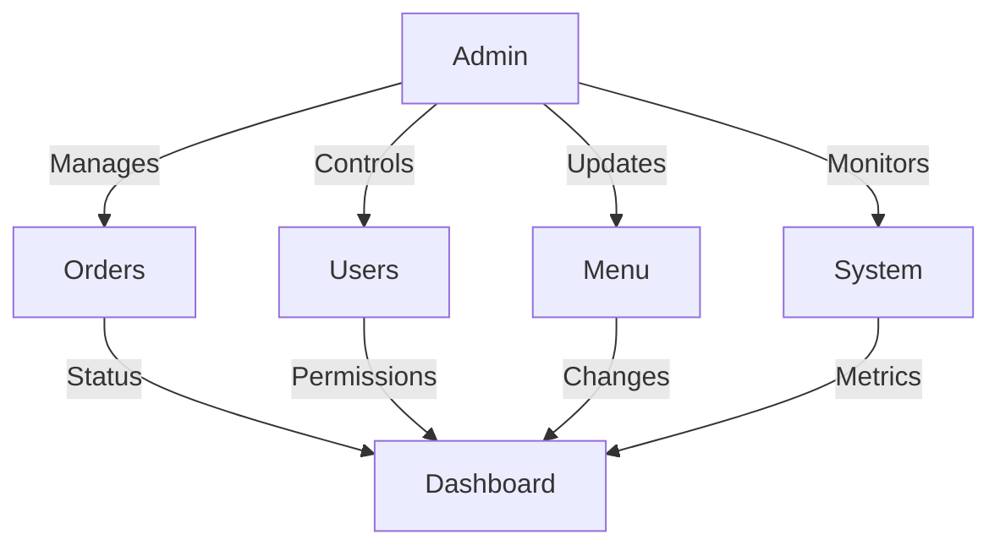

# K-Food Admin Module Documentation

## Overview

The admin module provides system management functionality including:

- Order management
- User administration
- Menu management
- System configuration
- Analytics and reporting

## Architecture

### Database Interaction

```php
// Connection handling through shared database.php
require_once __DIR__ . '/../includes/database.php';
$conn = initDatabaseConnection();
```

### Authentication Flow

1. Admin login
2. Role verification
3. Permission management
4. Session control

### Dashboard Integration

```javascript
// Real-time updates via WebSocket
const dashboardWS = new WebSocket(`ws://${WS_HOST}:${WS_PORT}/admin`);
dashboardWS.onmessage = handleDashboardUpdate;
```

## Core Components

### Order Management

1. Order Overview

   - Status monitoring
   - Order details
   - Update handling

2. User Management

   - Customer accounts
   - Crew accounts
   - Permission control

3. Menu Management
   - Item management
   - Category control
   - Pricing updates

### System Configuration

1. Settings

   - System preferences
   - Payment settings
   - Notification rules

2. Security
   - Access control
   - Audit logging
   - Backup management

## Data Flow



## Error Handling

```php
try {
    // Admin operation
} catch (Exception $e) {
    logError($e->getMessage(), [
        'module' => 'admin',
        'operation' => 'userManagement'
    ]);
}
```

## Security Measures

1. Access Control

   ```php
   if (!hasAdminPermission($operation)) {
       throw new SecurityException('Unauthorized access');
   }
   ```

2. Input Validation

   ```php
   $data = sanitizeInput($_POST['data']);
   validateAdminInput($data);
   ```

3. Audit Logging
   ```php
   logAdminAction($action, $details);
   ```

## API Endpoints

### Order Management

- GET /api/orders/list.php
- POST /api/orders/update.php
- GET /api/orders/stats.php

### User Management

- GET /api/users/list.php
- POST /api/users/manage.php
- POST /api/permissions/update.php

### Menu Management

- GET /api/menu/items.php
- POST /api/menu/update.php
- POST /api/categories/manage.php

## WebSocket Events

### Incoming Events

- order_placed
- user_action
- system_alert

### Outgoing Events

- status_update
- notification_broadcast
- system_update

## Configuration

Key configuration files:

- config.php: Main configuration
- admin_config.php: Admin-specific settings
- permissions.php: Access control rules

## Dependencies

- PHP 8.1+
- MySQL 8.0+
- Chart.js for analytics
- WebSocket server

## Backup and Recovery

1. Database backup system
2. Configuration backup
3. Recovery procedures

## Monitoring

1. System health checks
2. Performance monitoring
3. Error tracking
4. User activity logs
