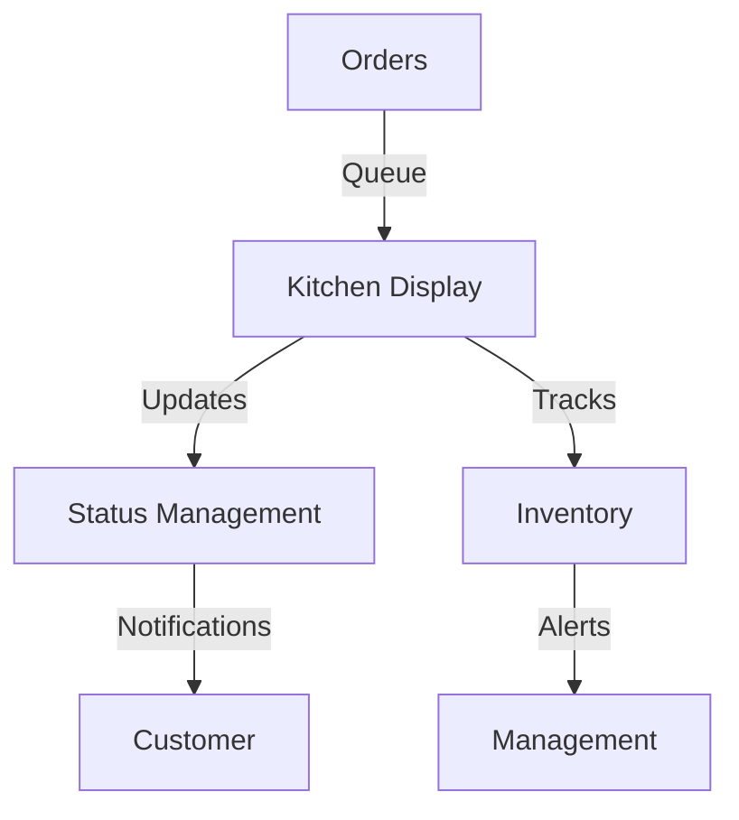

# K-Food Crew Module Documentation

## Overview

The crew module handles kitchen and service operations including:

- Order processing
- Kitchen management
- Order status updates
- Inventory tracking

## Architecture

### Database Interaction

```php
// Connection handling through shared database.php
require_once __DIR__ . '/../includes/database.php';
$conn = initDatabaseConnection();
```

### Authentication Flow

1. Crew login
2. Role verification
3. Station assignment
4. Session management

### Real-time Updates

```javascript
// Kitchen display system updates
const kitchenWS = new WebSocket(`ws://${WS_HOST}:${WS_PORT}/kitchen`);
kitchenWS.onmessage = handleKitchenUpdate;
```

## Core Components

### Order Processing

1. Order Queue

   - New orders
   - In progress
   - Completed orders

2. Kitchen Display

   - Order details
   - Preparation instructions
   - Timing management

3. Status Updates
   - Preparation status
   - Completion marking
   - Customer notifications

### Kitchen Management

1. Station Control

   - Station assignment
   - Workload distribution
   - Progress tracking

2. Inventory
   - Stock levels
   - Usage tracking
   - Alert thresholds

## Data Flow



## Error Handling

```php
try {
    // Kitchen operation
} catch (Exception $e) {
    logError($e->getMessage(), [
        'module' => 'crew',
        'operation' => 'orderProcessing'
    ]);
}
```

## Security Measures

1. Access Control

   ```php
   if (!hasCrewPermission($station)) {
       throw new SecurityException('Unauthorized station access');
   }
   ```

2. Input Validation

   ```php
   $data = sanitizeInput($_POST['data']);
   validateKitchenInput($data);
   ```

3. Activity Logging
   ```php
   logCrewAction($action, $details);
   ```

## API Endpoints

### Order Management

- GET /api/kitchen/queue.php
- POST /api/orders/update_status.php
- GET /api/orders/details.php

### Kitchen Management

- GET /api/stations/list.php
- POST /api/stations/assign.php
- POST /api/inventory/update.php

### Status Updates

- POST /api/status/update.php
- POST /api/notify/customer.php
- GET /api/kitchen/metrics.php

## WebSocket Events

### Incoming Events

- new_order
- status_request
- inventory_alert

### Outgoing Events

- order_update
- status_change
- preparation_complete

## Configuration

Key configuration files:

- config.php: Main configuration
- kitchen_config.php: Kitchen-specific settings
- stations.php: Station assignments

## Dependencies

- PHP 8.1+
- MySQL 8.0+
- WebSocket server
- Kitchen display system

## Station Management

1. Station Types

   - Main kitchen
   - Beverage station
   - Packaging area

2. Assignment Rules
   - Skill requirements
   - Workload balancing
   - Rotation schedule

## Performance Monitoring

1. Order timing
2. Station efficiency
3. Quality control
4. Customer satisfaction

## Emergency Procedures

1. System failure protocols
2. Backup ordering system
3. Communication procedures
