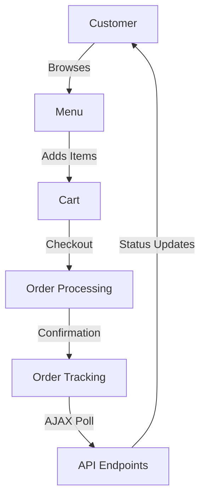

# K-Food Customer Module Documentation

## Overview

The customer module handles all customer-facing functionality including:

- Menu browsing and ordering
- Cart management
- Order tracking
- Profile management
- Payment processing

## Architecture

### Database Interaction

```php
// Connection handling through shared database.php
require_once __DIR__ . '/../includes/database.php';
$conn = initDatabaseConnection();
```

### Authentication Flow

1. Login/Registration
2. Session management
3. Role verification
4. Access control

### Real-Time Updates Integration

```javascript
// Initialize order status handler
const orderStatus = new OrderStatusHandler({
  onSuccess: (data) => handleOrderUpdate(data),
  onError: (error) => handleError(error),
});

// Start polling when needed
orderStatus.startPolling();
```

## Core Components

### Order Processing

1. Cart Management

   - Add/remove items
   - Update quantities
   - Calculate totals

2. Checkout Flow

   - Address verification
   - Payment processing
   - Order confirmation

3. Order Tracking
   - Real-time updates
   - Status notifications
   - Delivery tracking

### User Management

1. Profile

   - Personal information
   - Order history
   - Preferences

2. Security
   - Password management
   - Session handling
   - Input validation

## Data Flow



## Error Handling

```php
try {
    // Operation code
} catch (Exception $e) {
    logError($e->getMessage(), [
        'module' => 'customer',
        'operation' => 'orderProcess'
    ]);
}
```

## Security Measures

1. Input Validation

   ```php
   $data = sanitizeInput($_POST['data']);
   ```

2. Session Security

   ```php
   session_set_cookie_params([
       'secure' => true,
       'httponly' => true
   ]);
   ```

3. CSRF Protection
   ```php
   if ($_POST['csrf_token'] !== $_SESSION['csrf_token']) {
       throw new SecurityException('Invalid CSRF token');
   }
   ```

## API Endpoints

### Order Management

- POST /api/cart_operations.php
- POST /api/process_order.php
- GET /api/order_status.php

### User Management

- POST /api/update_profile.php
- POST /api/change_password.php
- GET /api/order_history.php

## AJAX Polling Configuration

### Endpoints

- GET `/api/order_status.php`: Poll order status
- GET `/api/kitchen_status.php`: Kitchen updates
- POST `/api/process_order.php`: Place orders
- GET `/api/payment_status.php`: Payment updates

### Polling Intervals

- Order Status: 5 seconds
- Kitchen Status: 10 seconds
- System Metrics: 30 seconds

### Error Handling

- Automatic retry with exponential backoff
- Fallback error notifications
- Connection status monitoring

## Configuration

Key configuration files:

- config.php: Main configuration
- websocket-config.js: WebSocket settings
- database.php: Database connection

## Dependencies

- PHP 8.1+
- MySQL 8.0+
- WebSocket server
- SMS gateway integration
