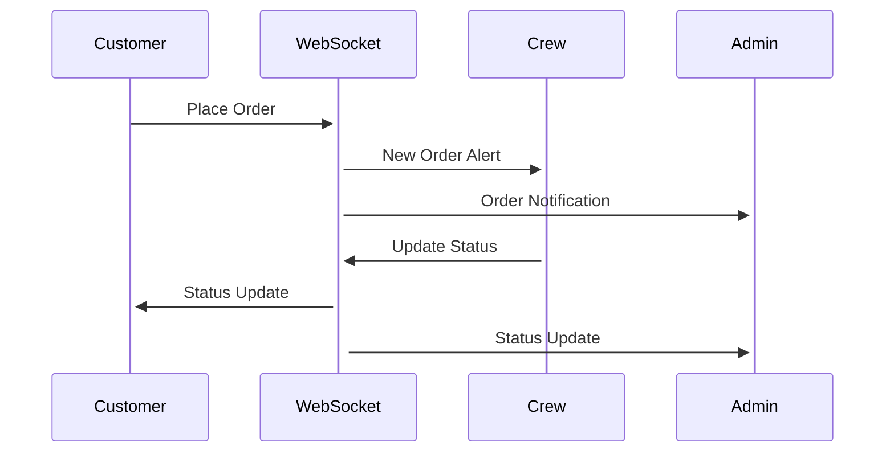
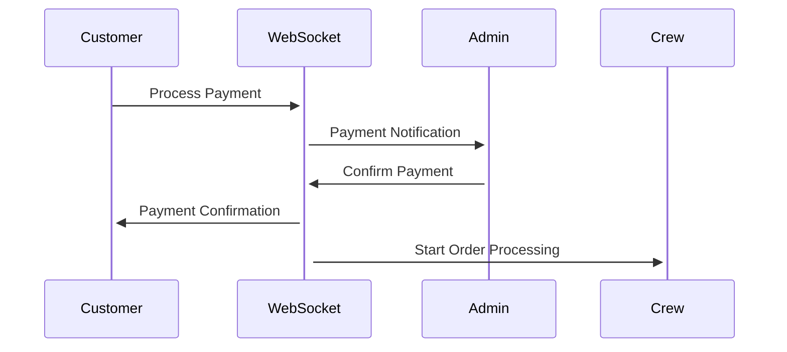
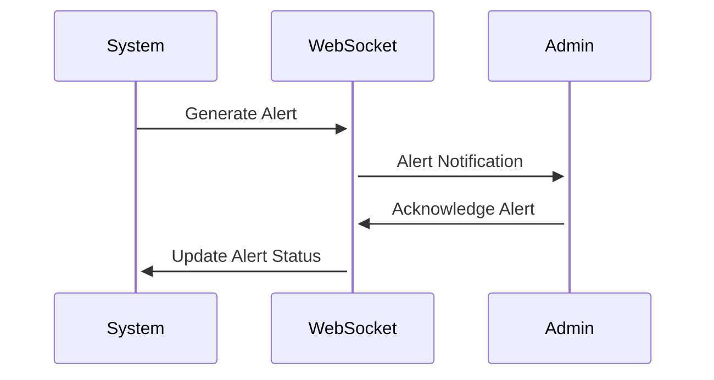

# KfoodDelights Module Documentation

## Overview

KfoodDelights consists of three primary modules that work together to provide a seamless food ordering experience:

1. Customer Module (k_food_customer)
2. Crew Module (k_food_crew)
3. Admin Module (k_food_admin)

## Module Interactions

### Customer Module (k_food_customer)

#### Core Responsibilities

- User authentication and profile management
- Menu browsing and cart management
- Order placement and tracking
- Payment processing
- Real-time order status updates

#### WebSocket Integration

```javascript
class CustomerWebSocketHandler {
  orderUpdate(data) {
    // Update order status in UI
    updateOrderStatus(data.orderId, data.status);

    // Show notification
    showNotification(data.message);

    // Update order history if needed
    if (data.status === "completed") {
      refreshOrderHistory();
    }
  }

  paymentUpdate(data) {
    // Handle payment confirmations
    handlePaymentStatus(data);
  }
}
```

### Crew Module (k_food_crew)

#### Core Responsibilities

- Order queue management
- Status updates
- Kitchen display system
- Inventory tracking
- Order fulfillment

#### WebSocket Integration

```javascript
class CrewWebSocketHandler {
  newOrder(data) {
    // Add order to queue
    addToOrderQueue(data.order);

    // Play notification sound
    playNewOrderAlert();

    // Update kitchen display
    refreshKitchenDisplay();
  }

  statusUpdate(data) {
    // Update order status
    updateOrderStatus(data.orderId, data.status);

    // Broadcast to customer
    broadcastStatusUpdate(data);
  }
}
```

### Admin Module (k_food_admin)

#### Core Responsibilities

- System monitoring
- User management
- Menu management
- Reports and analytics
- Configuration settings

#### WebSocket Integration

```javascript
class AdminWebSocketHandler {
  systemAlert(data) {
    // Handle system alerts
    processSystemAlert(data);
  }

  salesUpdate(data) {
    // Update real-time metrics
    updateDashboardMetrics(data);
  }
}
```

## Communication Flow

### 1. Order Placement Flow



### 2. Payment Processing Flow



### 3. System Alert Flow



## Module-specific Configurations

### Customer Module

```php
// WebSocket configuration
define('WS_CLIENT_TIMEOUT', 30);
define('WS_CLIENT_RECONNECT', 5);
```

### Crew Module

```php
// Order processing settings
define('ORDER_QUEUE_LIMIT', 20);
define('AUTO_REFRESH_INTERVAL', 30);
```

### Admin Module

```php
// Monitoring settings
define('ALERT_THRESHOLD', 100);
define('METRIC_UPDATE_INTERVAL', 60);
```

## Error Handling

### Customer Module

- Connection failures
- Payment processing errors
- Invalid order states

### Crew Module

- Queue overflow
- Status update failures
- Inventory sync errors

### Admin Module

- System alert failures
- Metric collection errors
- Configuration update errors
